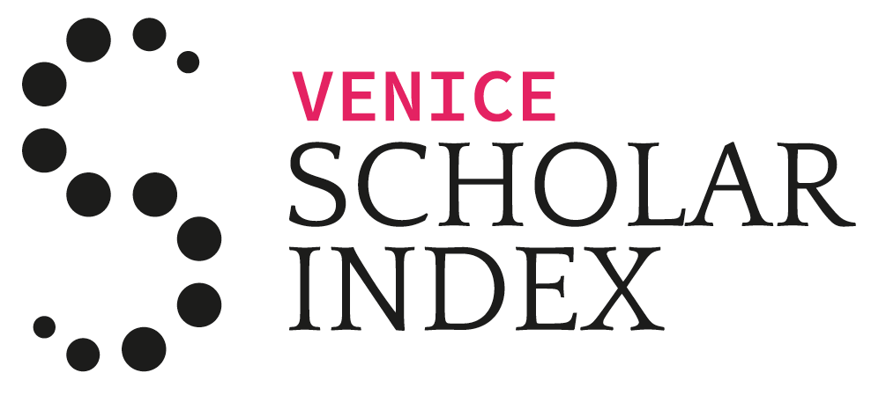

# Venice Scholar

The [Venice Scholar](http://www.venicescholar.eu/) is the citation index of the literature on the history of Venice. It aggregates all citations extracted from the digitized collections of the partner libraries and link it to their catalogues.

## Funders

The [Venice Scholar](http://www.venicescholar.eu/) was developed in the context of the Linked Books project, funded through a grant of the Swiss National Science Foundation (grant n. [159961](http://p3.snf.ch/project-159961)).

The development of the [Venetica section of the Venice Scholar](http://venicescholar.eu/venetica) and of the Europeana sidebar was made possible by a [Europeana Research Grant](https://pro.europeana.eu/services/facilitating-innovation/grants-programme).

## Team/Acknowledgments

- Vincent Barbay (development)
- Laurent Bolli (design)
- Giovanni Colavizza (conception, project management)
- Matteo Romanello (conception, project management)
- Silvia Ferronato (user testing)
- Martina Babetto (user testing)

## License

The code of the Scholar Library is released under an MIT license.

## Deployment Guide

- Clone repository
- composer install
- Create an Apache Virtual Host in pointing to "clone-path"/public
- Line .env file
